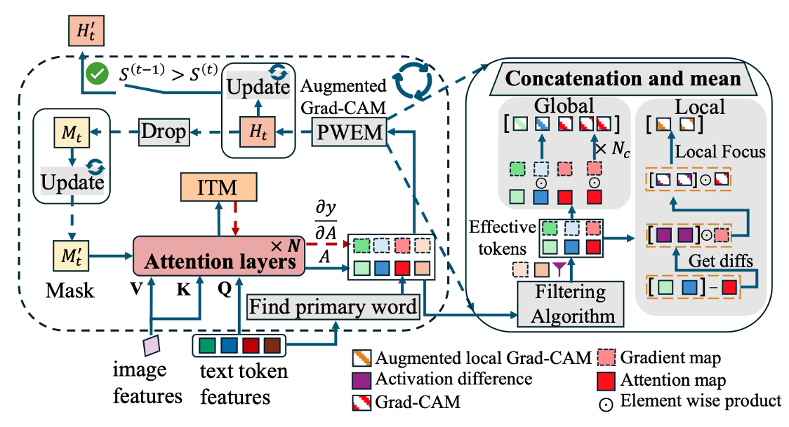

# IteRPrimE: Zero-shot Referring Image Segmentation with Iterative Grad-CAM Refinement and Primary Word Emphasis

## 📝 Overview



IteRPrimE is a novel framework for zero-shot referring image segmentation that leverages an Iterative Grad-CAM Refinement Strategy (IGRS) and a Primary Word Emphasis Module (PWEM) to improve localization accuracy—especially in cases with complex spatial descriptions. By using pre-trained vision-language models, IteRPrimE eliminates the need for further training or fine-tuning, achieving state-of-the-art performance on benchmarks such as RefCOCO, RefCOCO+, RefCOCOg, and PhraseCut.

## ✨ News

- [2025.04.05]🔥 The v1 of the code is now officially open-sourced!🎉
- [2024.12.10]🔥 IteRPrimE is accepted by AAAI-2025! 🥳

## 🛠 Installation

1. Create and activate a Conda environment:

```
conda create -n iterprime python=3.8.19
conda activate iterprime
```

2. Install the dependencies:

```
pip install -r requirements.txt
```

If you encounter any issues with the environment setup, you can refer to the configurations in the following two open-source projects for assistance:

- [GroundVLP](https://github.com/om-ai-lab/GroundVLP)

- [Mask2Former](https://github.com/facebookresearch/Mask2Former)

## 🏋️ Preparing Pretrained Model Weights

Before you can run the code, you'll need to prepare the pretrained model weights and dataset. Please follow the steps below:

### 1. Create the necessary directories

In the root directory of the project, create two directories: `checkpoints` and `data`.

```bash
mkdir checkpoints
mkdir data
```

### 2. Download the pretrained model weights

Download the following pretrained model weights and place them in the checkpoints folder. You can download them directly from the given links.

- **Mask2Former weights:** [model_final_f07440.pkl](https://pan.baidu.com/s/1phxTevS--Pe-3p611Pt75g) [pt6z] 
- **ALBEF weights:** [ALBEF.pth](https://pan.baidu.com/s/1GlO1LIjjvp_G5fb7z49VJQ) [8u5y] 
- **Stanza weights:** [pweight.zip](https://pan.baidu.com/s/1P1bHVgiRUGsm1bWzcCy5-w) [6f84] 
- **BERT-base-uncased weights:** [bert-base-uncased.zip](https://pan.baidu.com/s/1l9afrG0tgAHDArh6ON3ieA)[bggq] 

After downloading, extract the weight files (if in a compressed format) into the checkpoints folder. Your folder structure should look like this:

```shell
<root_directory>/
│
├── checkpoints/
│   ├── model_final_f07440.pkl
│   ├── ALBEF.pth
│   ├── pweight/
│   └── bert-base-uncased/
└── data/
```

### 3. Download the COCO dataset

Download the COCO dataset from the provided link and place it in the data folder.

- **COCO dataset:** [coco.zip](https://pan.baidu.com/s/1MxNHMRmlkqLqsd9MWFWHpQ) [egus] 

After downloading, extract the coco.zip file to the data folder. The final directory structure should look like this:

```shell
<root_directory>/
│
├── data/
│   └── coco/
└── checkpoints/
```

Once the weights and dataset are in place, you’re ready to run the code and start testing the model.


## 🚀 Running the Demo

To quickly verify your setup and see IteRPrimE in action, follow these steps:

1. **Navigate to the `demo` directory**:

```bash
cd demo
```

2.	**Run the main script**:

Run following code to evaluate IteRPrimE on **refcoco testA** datasets:

```bash
python IteRPrimE.py --data-set refcoco --image-set testA
```

This script will:

- Load the necessary configurations and pretrained model weights.

- Perform zero-shot referring image segmentation on a sample image or dataset.

- Output the segmentation results for you to inspect.


Depending on your configuration, the output images or logs may be saved to a specific folder (e.g., outputs/). Check the script and your config settings for details.

If you encounter any issues or have questions, feel free to open an issue or start a discussion.


## 📖 Citation

If you use IteRPrimE in your research, please cite our paper:

```
@article{wang2025iterprime,
  title={IteRPrimE: Zero-shot Referring Image Segmentation with Iterative Grad-CAM Refinement and Primary Word Emphasis},
  author={Wang, Yuji and Ni, Jingchen and Liu, Yong and Yuan, Chun and Tang, Yansong},
  journal={arXiv preprint arXiv:2503.00936},
  year={2025}
}
```

## 🤝 Acknowledgements

We appreciate the support from our collaborators and funding agencies. Stay tuned for updates—the full code release will be coming soon!

We would also like to express our gratitude to the authors of [GroundVLP](https://github.com/om-ai-lab/GroundVLP) and [Mask2Former](https://github.com/facebookresearch/Mask2Former) for their inspiring work and open-source contributions, which served as valuable references for this project.
